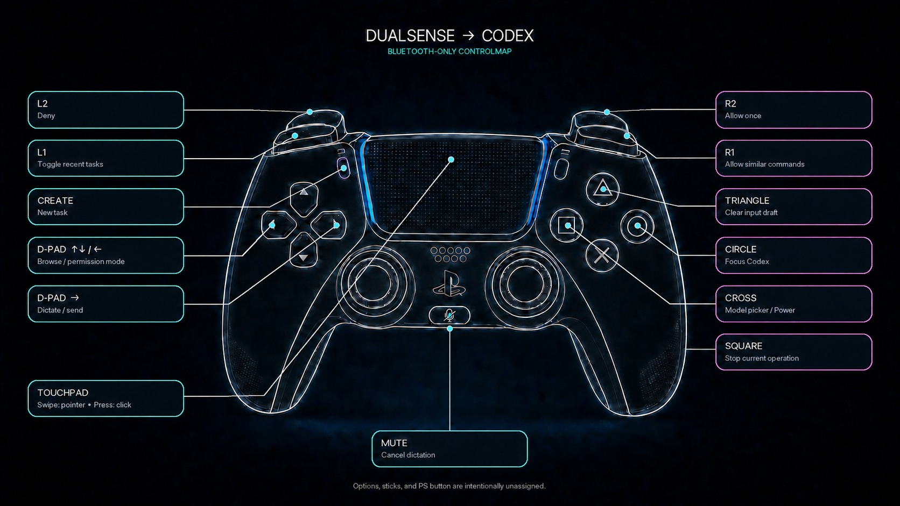

# Controller

A work-in-progress hardware controller for AI applications on macOS. It can
approve commands, move between tasks, control dictation, stop work, and provide
attention feedback. While Codex is frontmost, the DualSense touchpad also acts
as a relative pointing surface. `Cross` opens a compact model control layer for
changing Codex Power and selecting Standard or Fast mode.



> [!WARNING]
> **Work in progress:** this project is under active development. Its behavior,
> compatibility, and safety guarantees may change; nothing is guaranteed to work.

## Current support

The only supported configuration today is a Bluetooth DualSense with Codex
Desktop on macOS. Other controllers and AI applications are not supported yet.

## What it does

- Maps physical controller input to a small, versioned set of application
  actions.
- Controls the current target application through live macOS Accessibility
  elements, never saved screen coordinates.
- Moves and clicks the pointer from the DualSense touchpad only while Codex is
  the frontmost application.
- Controls the live compact model picker without a hard-coded model or
  reasoning-effort catalog.
- Keeps action and voice mutations behind separate opt-in flags.
- Sends two short vibration pulses when a new task needs attention.
- Survives controller power cycles with a watchdog and capped reconnect
  backoff.
- Includes a safe simulator and Bluetooth diagnostics for development without
  controlling the target application.

## Button map

| Controller input | Current action |
| --- | --- |
| `Circle` | Bring the target application to the front and unlock the remaining controls |
| `Cross` | Open or close the compact model picker |
| `Create` | Create a new task |
| `L1` | Toggle between the last two opened tasks |
| `D-pad up / down` | Move visually through task history |
| `D-pad left` | Cycle enabled built-in permission modes |
| `D-pad right` | Start dictation, then transcribe and send |
| `Mute` | Cancel dictation without sending |
| `R2` | Allow once |
| `R1` | Open approval options and allow similar commands |
| `L2` | Deny |
| `Square` | Stop the current operation |
| `Triangle` | Clear the current input draft |
| Touchpad swipe | Move the mouse pointer |
| Touchpad press | Left-click at the current pointer location |

While the model picker is open, `D-pad left / right` moves the live Power
selector one step toward Faster or Smarter, `D-pad up` selects Fast mode, and
`D-pad down` selects Standard mode. `Circle` closes the picker in this state.
The controller never enters Advanced model options and does not store a model
catalog of its own.

Otherwise, D-pad navigation resets the next `L1` press to the previous task,
keeping the two-task toggle predictable. Unmapped controls are inert.

## Requirements for the current integration

- macOS with the currently supported AI application installed
- the currently supported controller paired in **System Settings → Bluetooth**
- Node.js and npm
- Xcode Command Line Tools for the native Objective-C helper
- Accessibility permission for the terminal or process running the daemon

The current integration is Bluetooth-only by design. A controller connected only
over USB is detected and rejected rather than used as a fallback.

## Quick start

Install dependencies, validate the project, then start the daemon:

```sh
npm install
npm run check
npm test
npm run daemon
```

The daemon command builds both the TypeScript project and the native helper
before starting. Run it from a macOS process that already has Accessibility
permission.

### Disable flags

Running without flags starts the complete controller with actions and native
dictation enabled:

```sh
npm run daemon
```

Disable either capability when running diagnostics:

```sh
# Keep voice, but disable pointer, model, approvals, navigation, task creation, and modes
npm run daemon -- --disable-actions

# Keep actions, but disable native dictation controls
npm run daemon -- --disable-voice

# Fully read-only diagnostics
npm run daemon -- --disable-actions --disable-voice
```

When the target application loses focus, the daemon locks immediately, stops
touchpad pointer output, and cancels active dictation. `Circle` remains
available globally so the controller can bring the application back.

## Explore safely

### Core simulator

The simulator exercises config parsing, debounce, locking, and routing without
opening or controlling any application:

```sh
npm run simulate
circle press
right.trigger.button press
mute press
```

It accepts `<control> <press|release>` lines and prints normalized decisions as
JSON. Physical bindings live in [`config.json`](config.json).

### Bluetooth diagnostics

```sh
# List matching HID devices
npm run spike:bt -- list

# Read input reports without sending controller output
npm run spike:bt -- input

# Explicitly test lightbar, player LEDs, and low-intensity rumble
npm run spike:bt -- feedback --confirm-output
```

`feedback` is the only diagnostic allowed to change controller output, and it
requires `--confirm-output`.

## Feedback and reconnect behavior

- A blue lightbar and center player LED indicate that application controls are
  unlocked.
- Errors use a short error feedback sequence.
- A new non-running application activity card that requires attention produces two
  short vibration pulses. Existing cards form a silent baseline after a daemon
  or application restart, so old notifications are not replayed.
- After a disconnect, HID error, or watchdog timeout, the daemon closes the
  old device and retries discovery with exponential backoff capped at 30
  seconds.
- Reconnection accepts a new macOS HID path but never preserves the unlocked
  state.

## Repository layout

| Path | Responsibility |
| --- | --- |
| [`config.json`](config.json) | Physical button bindings and debounce settings |
| [`src/core/`](src/core) | Config validation, lock policy, debounce, routing, and simulator input |
| [`src/daemon.ts`](src/daemon.ts) | Transport lifecycle, monitors, action dispatch, and shutdown |
| [`src/dualsense/`](src/dualsense) | Bluetooth HID input and current controller output reports |
| [`src/adapters/`](src/adapters) | Current application actions and native dictation |
| [`src/macos/`](src/macos) | TypeScript boundary for the native helper and monitors |
| [`helpers/macos-control/`](helpers/macos-control) | Narrow macOS Accessibility implementation |
| [`src/runtime/`](src/runtime) | Reconnect backoff and connection watchdog |
| [`src/launchd/`](src/launchd) | launchd plist generation and background-agent management |
| [`docs/implementation-plan.md`](docs/implementation-plan.md) | Hardware validation record and acceptance matrix |

## Development

Run the complete local verification set before committing:

```sh
npm run check
npm test
make -C helpers/macos-control
git diff --check
```

When adding or renaming an action, update the action type, config binding,
daemon dispatcher, adapter, tests, this README, and the validation matrix
together.

### launchd package

Generate and inspect a local launchd plist without installing it:

```sh
npm run package:launchd
plutil -lint dist/com.codex.dualsense-control.plist
```

### Background agent

To install and start the daemon as a per-user `launchd` agent:

```sh
npm run daemon:background -- start
```

The command regenerates the plist, copies it to
`~/Library/LaunchAgents/com.codex.dualsense-control.plist`, then bootstraps the
enabled-by-default daemon in the current user's GUI session. Inspect or stop it
without restarting the daemon:

```sh
npm run daemon:background -- status
npm run daemon:background -- stop
```

For detailed hardware gates and the latest acceptance matrix, see the
[`validated implementation plan`](docs/implementation-plan.md).

Requested work outside the validated v0 baseline is tracked in the
[controller backlog](docs/backlog.md). Model/Power control and the general
touchpad pointer path are implemented with hardware validation pending;
configurable mapping profiles remain proposed.

## Acknowledgments

Initial concept co-created with [@glebsinev](https://github.com/glebsinev).
