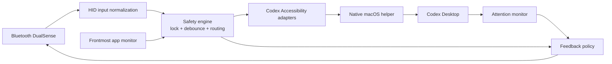

# DualSense Codex Control

Turn a Bluetooth DualSense into a focused hardware remote for Codex Desktop on
macOS. Approve commands, move between tasks, control dictation, stop work, and
feel when Codex needs your attention.


> [!IMPORTANT]
> The daemon is deliberately fail-closed. Outside Codex, every input is locked
> except `Circle`, which brings Codex to the front. USB controllers are rejected.

## What it does

- Maps physical DualSense input to a small, versioned set of Codex actions.
- Controls Codex through live macOS Accessibility elements, never saved screen
  coordinates.
- Keeps action and voice mutations behind separate opt-in flags.
- Sends two short vibration pulses when a new Codex task needs attention.
- Survives controller power cycles with a watchdog and capped reconnect
  backoff.
- Includes a safe simulator and Bluetooth diagnostics for development without
  controlling Codex.

## Button map

| DualSense input | Codex action |
| --- | --- |
| `Circle` | Bring Codex to the front and unlock the remaining controls |
| `Create` | Create a new task |
| `L1` | Toggle between the last two opened tasks |
| `D-pad up / down` | Move visually through task history |
| `D-pad left` | Cycle enabled built-in permission modes |
| `D-pad right` | Start dictation, then transcribe and send |
| `Mute` | Cancel dictation without sending |
| `R2` | Allow once |
| `R1` | Open approval options and allow similar commands |
| `L2` | Deny |
| `Square` | Stop the current operation |
| `Triangle` | Clear the current input draft |

Unmapped controls are inert. D-pad navigation resets the next `L1` press to
the previous task, keeping the two-task toggle predictable.

## How it works



1. `node-hid` and `dualsense-ts` open a wireless DualSense and normalize HID
   reports into button press/release events.
2. The controller engine debounces duplicate reports and checks its lock before
   routing an action.
3. A native helper continuously reports whether Codex is frontmost. The engine
   locks on startup, disconnect, foreground-monitor failure, and shutdown.
4. Narrow Accessibility adapters resolve one unique, enabled Codex element by
   its current role and label. Ambiguous or missing targets fail without
   clicking anything.
5. Some Electron controls report a successful `AXPress` without acting. For
   those controls, the helper derives a mouse click from the matched element's
   current AX frame. There are no hard-coded coordinates.
6. State and attention events flow back to the controller as lightbar,
   player-LED, and rumble feedback.

## Requirements

- macOS with Codex Desktop installed
- a DualSense paired in **System Settings → Bluetooth**
- Node.js and npm
- Xcode Command Line Tools for the native Objective-C helper
- Accessibility permission for the terminal or process running the daemon

This project is Bluetooth-only by design. A controller connected only over USB
is detected and rejected rather than used as a fallback.

## Quick start

Install dependencies, validate the project, then start the daemon:

```sh
npm install
npm run check
npm test
npm run daemon -- --enable-actions --enable-voice
```

The daemon command builds both the TypeScript project and the native helper
before starting. Run it from a macOS process that already has Accessibility
permission.

### Mutation flags

Running without flags keeps the external integrations in dry-run mode:

```sh
npm run daemon
```

Enable the two mutation boundaries independently:

```sh
# Approvals, navigation, task creation, stopping, draft clearing, and modes
npm run daemon -- --enable-actions

# Native Codex dictation controls
npm run daemon -- --enable-voice

# Complete controller
npm run daemon -- --enable-actions --enable-voice
```

When Codex loses focus, the daemon locks immediately and cancels active
dictation. `Circle` remains available globally so the controller can bring
Codex back.

## Explore safely

### Core simulator

The simulator exercises config parsing, debounce, locking, and routing without
opening or controlling any application:

```sh
npm run simulate
circle press
right.trigger.button press
mute press
```

It accepts `<control> <press|release>` lines and prints normalized decisions as
JSON. Physical bindings live in [`config.json`](config.json).

### Bluetooth diagnostics

```sh
# List matching HID devices
npm run spike:bt -- list

# Read input reports without sending controller output
npm run spike:bt -- input

# Explicitly test lightbar, player LEDs, and low-intensity rumble
npm run spike:bt -- feedback --confirm-output
```

`feedback` is the only diagnostic allowed to change controller output, and it
requires `--confirm-output`.

## Feedback and reconnect behavior

- A blue lightbar and center player LED indicate that Codex controls are
  unlocked.
- Errors use a short error feedback sequence.
- A new non-running Codex activity card that requires attention produces two
  short vibration pulses. Existing cards form a silent baseline after a daemon
  or Codex restart, so old notifications are not replayed.
- After a disconnect, HID error, or watchdog timeout, the daemon closes the
  old device and retries discovery with exponential backoff capped at 30
  seconds.
- Reconnection accepts a new macOS HID path but never preserves the unlocked
  state.

## Repository layout

| Path | Responsibility |
| --- | --- |
| [`config.json`](config.json) | Physical button bindings and debounce settings |
| [`src/core/`](src/core) | Config validation, lock policy, debounce, routing, and simulator input |
| [`src/daemon.ts`](src/daemon.ts) | Transport lifecycle, monitors, action dispatch, and shutdown |
| [`src/dualsense/`](src/dualsense) | Bluetooth HID input and Sony output reports |
| [`src/adapters/`](src/adapters) | Codex actions and native dictation |
| [`src/macos/`](src/macos) | TypeScript boundary for the native helper and monitors |
| [`helpers/macos-control/`](helpers/macos-control) | Narrow macOS Accessibility implementation |
| [`src/runtime/`](src/runtime) | Reconnect backoff and connection watchdog |
| [`src/launchd/`](src/launchd) | launchd plist generation and background-agent management |
| [`docs/implementation-plan.md`](docs/implementation-plan.md) | Hardware validation record and acceptance matrix |

## Development

Run the complete local verification set before committing:

```sh
npm run check
npm test
make -C helpers/macos-control
git diff --check
```

When adding or renaming an action, update the action type, config binding,
daemon dispatcher, adapter, tests, this README, and the validation matrix
together.

### launchd package

Generate and inspect a local launchd plist without installing it:

```sh
npm run package:launchd
plutil -lint dist/com.codex.dualsense-control.plist
```

### Background agent

To install and start the daemon as a per-user `launchd` agent:

```sh
npm run daemon:background -- start
```

The command regenerates the plist, copies it to
`~/Library/LaunchAgents/com.codex.dualsense-control.plist`, then bootstraps it
in the current user's GUI session with both `--enable-actions` and
`--enable-voice`. Inspect or stop it without restarting the daemon:

```sh
npm run daemon:background -- status
npm run daemon:background -- stop
```

## Current boundaries

- Codex Desktop and macOS Accessibility are the only application-control path.
- Approval buttons exist only while Codex is asking for approval; pressing an
  approval binding at any other time safely fails.
- UI control labels and roles must remain compatible with the installed Codex
  Desktop build.
- Cursor, Handy, generic pointer control, USB fallback, and ownership of a
  separate `codex app-server` are outside this project's scope.
- Generated build output, the native helper binary, coverage, logs,
  `node_modules/`, and `dist/` remain untracked.

For detailed hardware gates and the latest acceptance matrix, see the
[`validated implementation plan`](docs/implementation-plan.md).
